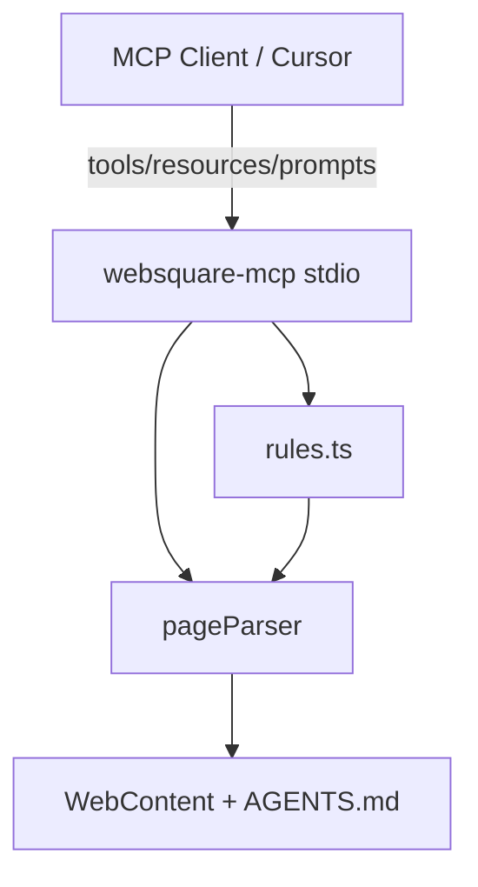

# websquare-mcp

**Model Context Protocol (MCP) server for WebSquare5 development.**

`websquare-mcp` gives AI agents structured access to WebSquare page files: parse XML, validate against project rules, scaffold new pages, and surface official documentation search patterns. It performs **static analysis only** — no WebSquare engine or Studio license required.

## Features

| Capability | Description |
|------------|-------------|
| **Page analysis** | Extract DataLists, Submissions, GridViews, components, and `scwin` handlers |
| **Validation** | Enforce AGENTS.md rules (bindings, handlers, forbidden APIs) |
| **Scaffolding** | Generate grid or form pages from templates |
| **Doc guidance** | Return Inswave URLs and curated web search queries |
| **Resources** | Expose rules and page index via MCP resource URIs |
| **Prompts** | Pre-built agent workflows for common tasks |

## Requirements

- **Node.js** ≥ 18
- **pnpm** ≥ 9 (recommended; see `packageManager` in `package.json`)
- A WebSquare project with `WebContent/` (or `websquare-demo/WebContent/`)
- **`AGENTS.md`** at project root (rules source of truth)

## Installation

```bash
cd websquare-mcp
pnpm install
pnpm run build
```

## Cursor integration

Add to `.cursor/mcp.json` at your workspace root:

```json
{
  "mcpServers": {
    "websquare": {
      "command": "node",
      "args": ["websquare-mcp/dist/index.js"],
      "env": {
        "WEBSQUARE_PROJECT_ROOT": "${workspaceFolder}"
      }
    }
  }
}
```

Reload Cursor after building. The server appears as **`websquare`**.

### Claude Desktop / other MCP clients

```json
{
  "mcpServers": {
    "websquare": {
      "command": "node",
      "args": ["/absolute/path/to/websquare-mcp/dist/index.js"],
      "env": {
        "WEBSQUARE_PROJECT_ROOT": "/absolute/path/to/your/project"
      }
    }
  }
}
```

## Configuration

| Variable | Required | Description |
|----------|----------|-------------|
| `WEBSQUARE_PROJECT_ROOT` | Recommended | Workspace root. Server walks up from here to find `AGENTS.md` and `WebContent/`. |

### Path resolution

On startup the server resolves:

| Path | Resolution order |
|------|------------------|
| **WebContent** | `{root}/websquare-demo/WebContent` → `{root}/WebContent` |
| **AGENTS.md** | `{root}/AGENTS.md` |
| **Templates** | `websquare-mcp/templates/` (bundled with server) |

## Tools

### `get_dev_rules`

Return WebSquare development rules from `AGENTS.md`.

| Parameter | Type | Description |
|-----------|------|-------------|
| `section` | `string?` | Filter by `##` heading (e.g. `Coding rules`) |

---

### `list_pages`

List all `.xml` files under `WebContent/`.

No parameters. Returns `{ webContentDir, pages: string[] }`.

---

### `read_page`

Read raw XML plus parsed analysis summary.

| Parameter | Type | Description |
|-----------|------|-------------|
| `path` | `string` | Relative path under WebContent (e.g. `ui/main.xml`) |

---

### `analyze_page`

Structured extraction without raw XML.

| Parameter | Type | Description |
|-----------|------|-------------|
| `path` | `string` | Relative path under WebContent |

**Returns:** `dataLists`, `submissions`, `gridViews`, `components`, `scwinFunctions`, `submissionCalls`, `eventHandlers`.

---

### `validate_page`

Run AGENTS.md rule checks on a page.

| Parameter | Type | Description |
|-----------|------|-------------|
| `path` | `string` | Relative path under WebContent |

**Returns:**

```json
{
  "valid": true,
  "errorCount": 0,
  "warningCount": 0,
  "issues": [
    {
      "severity": "error",
      "rule": "grid-column-match",
      "message": "...",
      "fix": "..."
    }
  ]
}
```

#### Validation rules

| Rule ID | Severity | Check |
|---------|----------|-------|
| `submission-api` | error | No `$w.executeSubmission` — use `$p` |
| `no-dom-api` | error | No `document.querySelector` in script |
| `no-es-modules` | error | No `import` in script blocks |
| `submission-ref` | error | `executeSubmission` ids match `xf:submission` |
| `scwin-defined` | error | XML event handlers exist on `scwin` |
| `scwin-handler` | warning | Handlers should use `scwin.*` prefix |
| `grid-binding-syntax` | error | GridView `dataList` uses `data:...` form |
| `grid-datalist-exists` | error | Bound DataList exists |
| `grid-column-match` | error | gBody column ids ⊆ DataList column ids |
| `submission-target` | warning | `target` uses `data:json,<id>` or `data:xml,<id>` |
| `submission-action` | warning | `action` path looks servable from WebContent |
| `unique-component-id` | error | No duplicate component ids in body |

---

### `scaffold_page`

Create a new page under `WebContent/ui/` from a template.

| Parameter | Type | Description |
|-----------|------|-------------|
| `name` | `string` | File name (e.g. `users` or `users.xml`) |
| `template` | `"grid"` \| `"form"` | Template type |
| `pageTitle` | `string?` | Display title |
| `dataListId` | `string?` | Grid: DataList id (default `dlt_{name}`) |
| `submissionId` | `string?` | Grid: Submission id (default `sbm_load_{name}`) |
| `submissionAction` | `string?` | Grid: action URL (default `/data/{name}.json`) |
| `dataMapId` | `string?` | Form: DataMap id (default `dma_{name}`) |
| `columns` | `{ id, name }[]?` | Column/field definitions |

Returns `{ created, template, validation }`. **Writes to disk.**

---

### `suggest_search`

Return official doc links and web search queries for a task or component.

| Parameter | Type | Description |
|-----------|------|-------------|
| `task` | `string` | Task or symptom (e.g. `submission`, `grid empty`) |
| `component` | `string?` | Component name (e.g. `gridView`) |

Does not scrape external sites — returns curated links and query strings from AGENTS.md patterns.

## Resources

| URI | MIME | Content |
|-----|------|---------|
| `websquare://rules` | `text/markdown` | Full `AGENTS.md` |
| `websquare://pages` | `application/json` | Page index with component/DataList counts |
| `websquare://page/{path}` | `application/xml` | Raw page XML (path relative to WebContent) |

## Prompts

| Prompt | Use when |
|--------|----------|
| `create-grid-page` | New page with DataList + Submission + GridView |
| `add-submission` | Wire static JSON or API into existing page |
| `fix-grid-binding` | Grid empty or binding mismatch |

Prompts instruct the agent to call `analyze_page` and `validate_page` before editing.

## Architecture

```
websquare-mcp/
├── src/
│   ├── index.ts           # MCP server entry (stdio)
│   ├── config.ts          # Project path resolution
│   ├── parsers/           # XML → PageAnalysis
│   ├── validators/        # AGENTS.md rule engine
│   ├── scaffold.ts        # Template rendering
│   ├── suggestSearch.ts   # Doc/search helpers
│   ├── prompts/           # MCP prompt definitions
│   └── utils/files.ts     # File I/O + parse pipeline
├── templates/             # grid-page.xml, form-page.xml
└── scripts/try-mcp.mjs    # Local integration test
```



**Transport:** stdio only (v1). Suitable for local IDE integration; no HTTP server exposed.

## Development

```bash
pnpm run build          # Compile TypeScript
pnpm start              # Run MCP server (stdio — blocks)
node scripts/try-mcp.mjs   # Smoke test all tools
```

### Smoke test

`scripts/try-mcp.mjs` spawns the server, lists tools, and calls `list_pages`, `analyze_page`, `validate_page`, and `suggest_search` against `ui/main.xml`.

## Limitations (v1)

- **No WebSquare engine** — cannot render pages or execute Submissions
- **No Studio API** — cannot drive WebSquare Studio
- **No live doc fetch** — `suggest_search` returns links/queries only
- **Static XML only** — validation is heuristic; edge-case XML may parse incorrectly
- **stdio transport** — not designed for remote/network deployment without a wrapper

## Security

- Reads/writes only under resolved `WebContent/` and reads `AGENTS.md`
- `scaffold_page` **writes files** — agents should confirm path before scaffolding in production workflows
- No network calls at runtime
- No secrets or credentials handled

## Related

- [AGENTS.md](./AGENTS.md) — agent instructions for this MCP
- [../AGENTS.md](../AGENTS.md) — WebSquare5 coding rules (project root)
- [../websquare-demo/](../websquare-demo/) — sample WebSquare project

## License

Part of [cursorProject](https://github.com/nttung997/cursorProject). WebSquare5 is a commercial product by Inswave; this MCP does not include the WebSquare engine.
